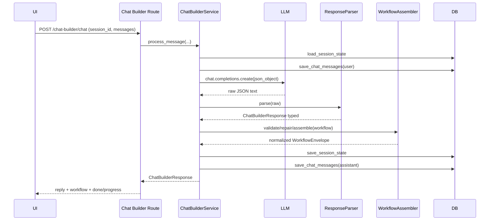
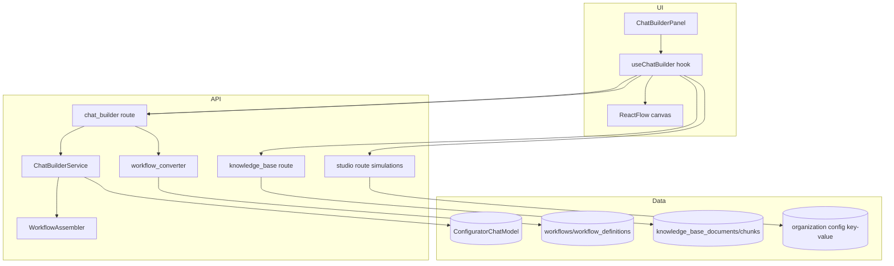

# Agent Creation via Prompt: Current Architecture and Future Plan

## ⚠️ Current Problems

Before reviewing the architecture, these are the key pain points driving the upcoming changes:

1. **Bad structure of initial nodes** — The first workflow generated from a prompt often produces poorly structured nodes that don't reflect a clean, usable pathway. The initial graph shape requires significant rework before it's production-ready.

2. **Too many follow-ups to build the initial workflow** — Users need to go back and forth with the builder far too many times just to get a baseline workflow created. The initial generation should require minimal correction turns.

3. **Doc parsing not giving clear instructions** — When documents are uploaded, the parsing pipeline fails to extract structured, actionable instructions from them. This forces users into additional follow-up turns to clarify what the document already contained.

---

## 1) Scope

This document maps the current prompt-driven agent creation flow end-to-end, then proposes a practical future planner for:

1. Knowledge base onboarding first (text files and DB-backed retrieval).
2. Follow-up agent changes after an initial pathway is built.

## 2) Current Architecture (One by One)

## 2.1 Entry Points and Router Wiring

- Main API router includes chat builder, knowledge base, and studio routes.
- Chat builder endpoints are:
1. POST /api/v1/chat-builder/chat
2. GET /api/v1/chat-builder/session/{session_id}
3. POST /api/v1/chat-builder/finalize

```mermaid
flowchart LR
  A[UI Chat Builder Page] --> B[/api/v1/chat-builder/chat]
  A --> C[/api/v1/chat-builder/finalize]
  A --> D[/api/v1/chat-builder/session/{id}]
  A --> E[/api/v1/knowledge-base/*]
  A --> F[/api/v1/studio/simulations*]

  B --> G[ChatBuilderService]
  G --> H[(ConfiguratorChatModel session state)]
  C --> I[(workflows + workflow_definitions)]
  E --> J[(knowledge_base_documents + knowledge_base_chunks)]
  F --> K[(organization configuration key: ooom_studio_simulation_scenarios)]
```

## 2.2 UI Flow (Prompt to Canvas)

- The page at ui/src/app/workflow/chat-builder/page.tsx renders:
1. Left side conversational panel.
2. Right side live React Flow canvas.
- The hook ui/src/hooks/useChatBuilder.ts:
1. Creates session_id on the client (cb_<random>). 
2. Sends full message history to POST /chat-builder/chat.
3. Maps returned workflow nodes/edges to React Flow nodes/edges.
4. Calls POST /chat-builder/finalize to persist final workflow.

## 2.3 Chat Builder Service Orchestration

The core service is api/services/configurator/chat_builder_service.py. For each user turn it:

1. Validates request shape (last message must be user).
2. Loads prior session state (or initializes one).
3. Stores user message.
4. Builds a large system prompt with strict JSON schema and pathway rules.
5. Calls LLM with retries/backoff.
6. Parses JSON output with ResponseParser.
7. Validates workflow and repairs violations.
8. Assembles/normalizes workflow for React Flow compatibility.
9. Persists updated context and assistant message.
10. Returns reply, config, workflow, progress, done.



## 2.4 Persistence Model

- Session state is stored as system messages in ConfiguratorChatModel content JSON snapshots.
- Chat history is also stored in ConfiguratorChatModel with role user/assistant.
- Finalization creates a new workflow record and current workflow definition.

## 2.5 Workflow Conversion at Finalize

- Finalize uses to_studio_workflow(...) to map internal node types to studio node types.
- Important mapping currently includes:
1. knowledge_base -> agentNode
2. transfer -> endCall

This is functionally lossy if the node had type-specific behavior expected later.

## 2.6 Knowledge Base: Existing Capability

Knowledge base is already present and operational:

1. Upload URL generation: POST /knowledge-base/upload-url
2. Processing enqueue: POST /knowledge-base/process-document
3. Search: POST /knowledge-base/search
4. Listing/get/delete documents

Pipeline today:

1. File upload to storage key knowledge_base/{org_id}/{document_uuid}/{filename}
2. Background chunk/embedding task
3. Chunks persisted and searchable by vector similarity
4. Runtime tool retrieve_from_knowledge_base can be registered in workflow execution when node has document_uuids

## 2.7 Simulation/Testing Endpoints: Current Status

Studio has scenario endpoints:

1. GET /studio/simulations
2. POST /studio/simulations
3. POST /studio/simulations/run

Current run behavior is placeholder logic:

- A scenario passes if expected_outcome is non-empty.
- It does not execute workflow nodes or validate runtime transitions.

This is useful for scaffolding but not sufficient as node-level correctness testing.

## 3) Current-State Architecture View



## 4) Future Planner

## 4.1 Phase 1 (First): Knowledge Base Onboarding

Goal: guarantee every new prompt-built agent can optionally start with KB context from either uploaded text files or existing DB docs.

Plan:

1. Pre-build KB check:
- On chat-builder start, query organization documents.
- If none exist, offer quick ingest options:
1. Upload plain text file(s).
2. Use existing DB records or external source sync.

2. Prompt contract update:
- Add explicit KB intent flag in config envelope (for example: use_knowledge_base: true/false, kb_document_uuids).
- Require chat-builder to create at least one KB-enabled node when KB is requested.

3. Preserve node semantics on finalize:
- Keep KB node type in studio-compatible form where possible (prefer qa/tool-enabled node strategy) rather than collapsing to generic agentNode blindly.

4. Retrieval quality gates:
- Minimum chunk count and document status checks before allowing done=true.
- Block finalize if KB requested but no usable document_uuids are attached.

## 4.2 Phase 2: Follow-Up Agent Building (Pathway Already Exists)

Goal: safe iterative changes to existing pathways without destructive rewrites.

Plan:

1. Start from existing workflow as source of truth:
- Load workflow by id and inject full node/edge inventory to system prompt.

2. Change modes:
- Add explicit operation mode in prompt context: append | modify | remove.
- Require per-turn change summary from LLM:
1. nodes_added
2. nodes_modified
3. nodes_removed
4. edges_changed

3. Guarded edit rules:
- Prevent silent deletion of connected nodes.
- Require migration fixups for every removed node (edge rewiring or explicit tombstone).

4. Human-readable diff preview in UI:
- Before save, show deterministic graph diff and ask confirmation.

## 5) Recommended Implementation Order

1. Fix initial node structure quality — improve prompt engineering and schema constraints so the first-turn graph is well-formed.
2. Reduce follow-up turns for initial build — front-load context gathering (KB, intent, scope) before generation begins.
3. Improve doc parsing for structured instruction extraction — pre-process uploaded documents into explicit instruction sets before feeding to the builder.
4. Fix finalize conversion to preserve KB semantics.
5. Add KB-first onboarding checks in chat-builder flow.
6. Add incremental edit mode with explicit graph diff/confirmation.

## 6) Definition of Done (Future Planner)

1. KB-first:
- User can attach text documents and/or pick existing org docs before finalize.
- Done state fails when KB required but not connected.

2. Follow-up editing:
- Existing pathway modifications are diffed, reviewable, and reversible.